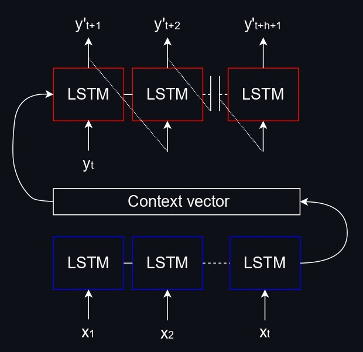

<div align="center">
  <h1>Seq2Seq neural network</h1>
  
  <picture>
  <source media="(prefers-color-scheme: dark)" srcset="analysis/Intro_dark.jpg">
  <source media="(prefers-color-scheme: light)" srcset="analysis/Intro_light.jpg">
  
  </picture>
</div>

# <a name="s1"/> About the project

## <a name="s1.1"/> 1. Goal

Improve on a simple $LSTM$ neural network used in this [project](https://github.com/ghginm/LSTM) to better model highly volatile sequential data with a hierarchical structure.

## <a name="s1.2"/> 2. Data description

For this project, real-world data of beer consumption in Russia were used. All data were anonimised and modified; permission was given to share data for educational purposes. The dataset consists of 650 weekly time series and has over 88,000 observations.

## <a name="s1.3"/> 3. Project structure

```
├── Seq2Seq/
|   ├── analysis/
│   ├── data/
│   ├── model/
│   │   ├── hyperparam_inference.json
|   |   ├── model_0_param_n_epoch.pth
|   |   ├── model_1_param_n_epoch.pth
|   |   ├── model_2_param_n_epoch.pth
│   │   └── model_3_param_n_epoch.pth
|   ├── validation/
|   ├── config.json
│   ├── data_processing.py
│   ├── forecasting.py
│   ├── model_creation.py
│   └── train_val_test.py
```

**Directories**:

* `analysis/`: contains secondary files for analysing and visualising the results.
* `data/`: contains data for the project.
* `model/`: stores pretrained pytorch models.
* `validation/`: stores validation results.

**Scripts**:

* `config.json`: stores the script's parameters.
* `data_processing.py`: contains utility function for processing data (loading, splitting...).
* `forecasting.py`: implements forecasting.
* `model_creation.py`: a module that contains all necessary classes and functions for building a model.
* `train_val_test.py`: implements three modes: validation, training (several $Seq2Seq$ models) and test.

# <a name="s2"/> Key features

## <a name="s2.1"/> 1. Training

* **Information flow**:
  * The encoder passes hidden states $H_t$ and cell states $C_t$ to the decoder to carry over both short- and long-term memory.
  * If the decoder has multiple layers, two options are possible: either the final layer is taken to initialise the decoder's states or all $n$ layers are stacked along the hidden size dimension. The first option is more parsimonious, however, it is possible that previous layers can learn a different representation of the data compared to the final layer. Use the `hc_multilayer_stack` attribute, i.e. `EncoderDecoderLSTM(..., hc_multilayer_stack=False)`, to control this behaviour.
  * If the decoder's hidden state has a different shape compared to the encoder's one, a linear layer is used.
  * To maintain the gradient flow between the encoder and decoder, the gradients obtained from the encoder are not detached. In other words, the computational graph is shared between the encoder and the decoder.

* **Training strategies**:
  * **Teacher forcing**: this strategy is represented in the first part of the picture. Every time $y_{t+1}$ is predicted, the actual value $y_t$ from the previous period is used. During the inference this option cannot be used due to the fact that we don't have actual values from the previous time steps.
  * **Recursive**: this strategy is depicted in the second part of the picture. Every time $y_{t+1}$ is predicted, the forecasted value $\hat{y}_t$ from the previous period is used.
  * **Mixed**: by sampling from the Bernoulli distribution to switch training strategies, teacher forcing can be combined with the recursive approach. Thus, every iteration a Bernoulli trial is performed with a given probability: `train_validate(..., training_mode='mixed', teacher_forcing_prob=0.6)`.

<div align="center">
  <picture>
  <source media="(prefers-color-scheme: dark)" srcset="analysis/Model_dark.jpg">
  <source media="(prefers-color-scheme: light)" srcset="analysis/Model_light.jpg">
  
  </picture>
</div>

## <a name="s2.2"/> 2. Making models more robust

Working with time series usually requires cross validation for assessing model performance since a single validation set is insufficient – it most likely will not be representative of the entire sequence. Here is an example of training and validation loss graphs:

<div align="center">
  <picture>
  <source media="(prefers-color-scheme: dark)" srcset="analysis/Loss_dark.png">
  <source media="(prefers-color-scheme: light)" srcset="analysis/Loss_light.png">
  
  </picture>
</div>

Determining when to stop the training process can be quite a challenging task. The following strategies were implemented to partially solve this problem:

* **Multiple models**: $n$ models are trained and their predictions are averaged. In this case, 4 models were trained.
* **Checkpoints**: models' parameters are saved for the last $m$ epochs with a specified frequency, i.e. `train_validate(..., store_last_param=30, samp_freq_param=2)`. For example, if we train just one model for 100 epochs with the aforementioned parameters, we will get 15 distinct models whose results can then be averaged. Consequently, instead of relying on stopping the training process at the right time, which is difficult due to both high volatility and the lack of a truly stable CV procedure, we can mitigate the presence of unlucky seeds when a model doesn't converge or overfit by taking the average across multiple epochs.
* **Smoothing weights**: to generalise better and smooth out unwanted oscillations of weights, the exponential moving average of parameters can be enabled, e.g. `train_validate(..., ma_weights=True, beta=0.65)`. For this project, this parameter was turned off due to the lack of improvements.

This is a sample of the final forecast calculated as the average value across 4 models:

<div align="center">
  <picture>
  <source media="(prefers-color-scheme: dark)" srcset="analysis/Fc_dark.png">
  <source media="(prefers-color-scheme: light)" srcset="analysis/Fc_light.png">
  
  </picture>
</div>

# <a name="s3"/> Acknowledgements
* [Web traffic forecasting](https://github.com/Arturus/kaggle-web-traffic/tree/master)
* [LSTM encoder-decoder with PyTorch. Univariate time series](https://github.com/lkulowski/LSTM_encoder_decoder/tree/master)
* [LSTM encoder-decoder with PyTorch. Matching hidden states](https://discuss.pytorch.org/t/encoder-decoder-lstm-model-for-time-series-forecasting/189892)
